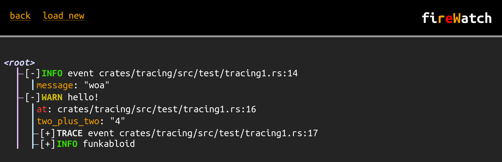

# `forrust_fire`

A collection of tools for analyzing execution flow in Rust:
- [`forrust_fire_tree`](https://crates.io/crates/forrust_fire_tree) (Rust crate): A tree data structure built for inserting quickly but finalizing slowly. This is useful for when you only sometimes want to use the finalized tree.
- [`forrust_fire_tracing`](https://crates.io/crates/forrust_fire_tracing) (Rust crate): Allows using [`tracing`](https://docs.rs/tracing/latest/tracing/) for building a tree of structured logs (both spans and events are nodes), and also exporting them as JSON.
- [`fireWatch`](https://purple-ic.github.io/forrust_fire/fireWatch/) (website): A viewer for files produced by `forrust_fire_tracing`. 

All together, these tools allow you to collect and view program execution flows. The experience similar to using a debugger (in fact, using a debugger is probably a better choice for a majority of cases) but can provide a different perspective. (_personally speaking_, I like it more than a debugger)

The intended way to use this collection is for you to build a custom test harness for your Rust project which runs your tests and, if they fail, exports a report of _how_ they failed. In the future, I'd like to create a public test harness but I'm still not 100% sure how it should be designed.

